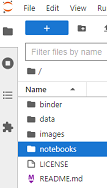
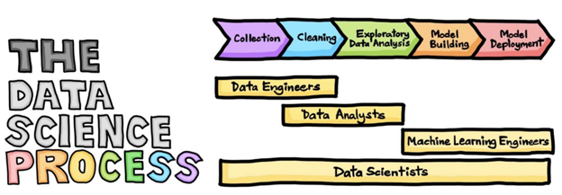

# Quickstart: Data Exploration and Analysis with Python

<blockquote>
    

        
         
        For use by members of Catalent's
        <a href="https://catalent.sharepoint.com/sites/EnterpriseDataScience" title="Catalent Data Science Hub">
            Data Science Community of Practice
        </a>
         
    

</blockquote>

    

## Getting Started

Click on the badge above to launch a [Jupyter Lab](https://blog.jupyter.org/jupyterlab-is-ready-for-users-5a6f039b8906) instance in [Binder](https://mybinder.readthedocs.io/en/latest/index.html), and open the file in the **notebooks** folder named after the desired procedure.
<blockquote>
    <ul>
        <li>
            For example, open 'exploratory_data_analysis.py' to work through a notebook of <em>Exploratory Data Analysis</em> </li>
        <li>
            After launching a Jupyter Lab instance, it is possible to switch to the "classic" <a href="https://jupyter-notebook.readthedocs.io/en/latest/">Jupyter Notebook</a> mode by manually changing the last portion of the URL from '/lab' to '/tree' and navigating to the modified address
        </li>
</blockquote>
 

## Contents

  
This repository provides an introduction to ***Exploratory Data Analysis*** and ***Data Cleaning*** in Python, and contains the following four (4) directories:  

- **binder**  
Contains .txt file with packages required to build a python environment for this repository using [Binder](https://mybinder.readthedocs.io/en/latest/index.html)

- **data**  
Contains .csv files with anonymized results from the questionnaires and surveys polled during our Kick Off sessions, as well as a sample dataset of the items sold in the [Cocoon Pharmacy site](https://www.cocooncenter.co.uk/c/cares-body.html) and their reviews [(from Kaggle).](https://www.kaggle.com/datasets/kholoudowais/cocooncenter-pharmacy)  

- **images**  
Contains .png files of graphics referenced in markdown across this repository

- **notebooks**  
Contains .ipynb files of *Exploratory Data Analysis* and *Data Cleaning* done on the contents of the **data** folder

## Contributors

*Miguel Montano*  

*Dev Shah*  

## License

This project is licensed under [GPL-3.0](LICENSE)
